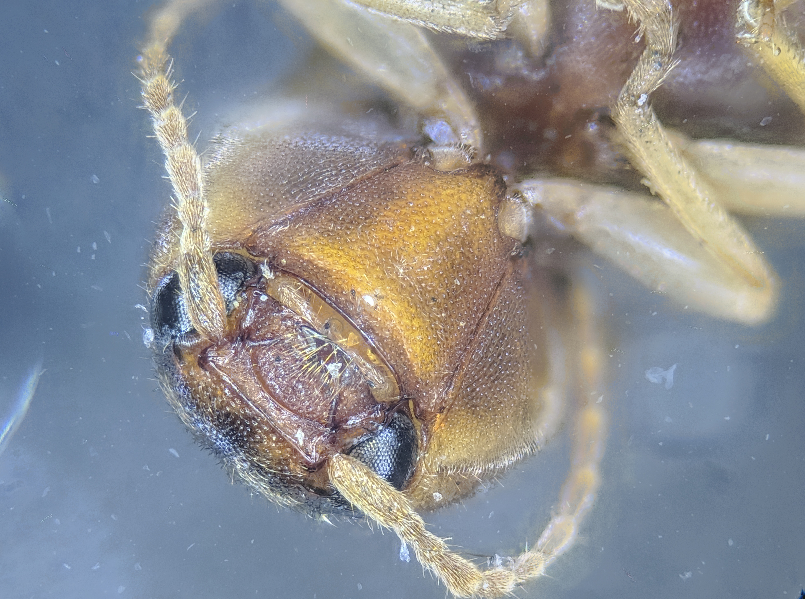

# GIMP Focus Stack Plugin
This is a GIMP plugin to do a focus stack of all the images in a selected directory. It uses the Windows compiled release of [PetteriAimonen's focus-stack](https://github.com/PetteriAimonen/focus-stack). He has a very nice writeup and more options than I used if you need something more. I used a Python wrapper for the GIMP plugin and then externally call his *focus-stack.exe*

## Installation
1. Copy in the *PhotoStack* directory and *PhotoStack.py* into your *%APPDATA%\GIMP\3.0\plug-ins* directory
1. Unzip the focus-stack.zip file into your *%APPDATA%\GIMP\3.0\scripts* directory. It should have a focus-stack folder inside of which is a focus-stack.exe and all supporting files
1. Start GIMP and you should see a new *Focus Stack...* option in the file menu

## Use
1. Choose the new *Focus Stack...* option in the File menu
1. Choose the folder containing your stack of images. The folder should only contain the images you want to stack and no other files. The file names should be in the focus stack order and can be any type recognized by OpenCV
1. The stacking can take some time if there are many images. The final image will be opened in the GIMP and all intermediate and the final image will be deleted, so you will need to save or export the open image from the GIMP

## Notes
* The optional flags used with photo-stack.exe are *--global-align* and *--align-keep-size*. This last might create some artifacting along the edges that may need to be cropped out. For now, you will need to edit the code to change options, but I may try to add some via the plugin at a later date
* Output is always a jpg from photo-stack.exe and so the open image will be 8bit/channel with a bit of compression loss (95 quality of 100)
* There are a set of test images in the repo that produce this as a final output:

